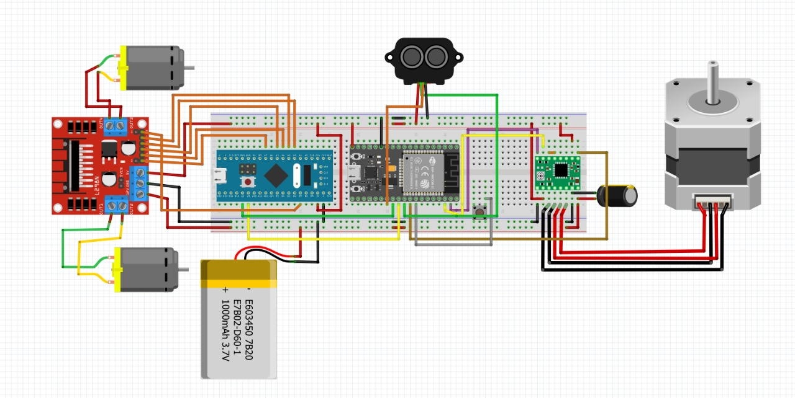
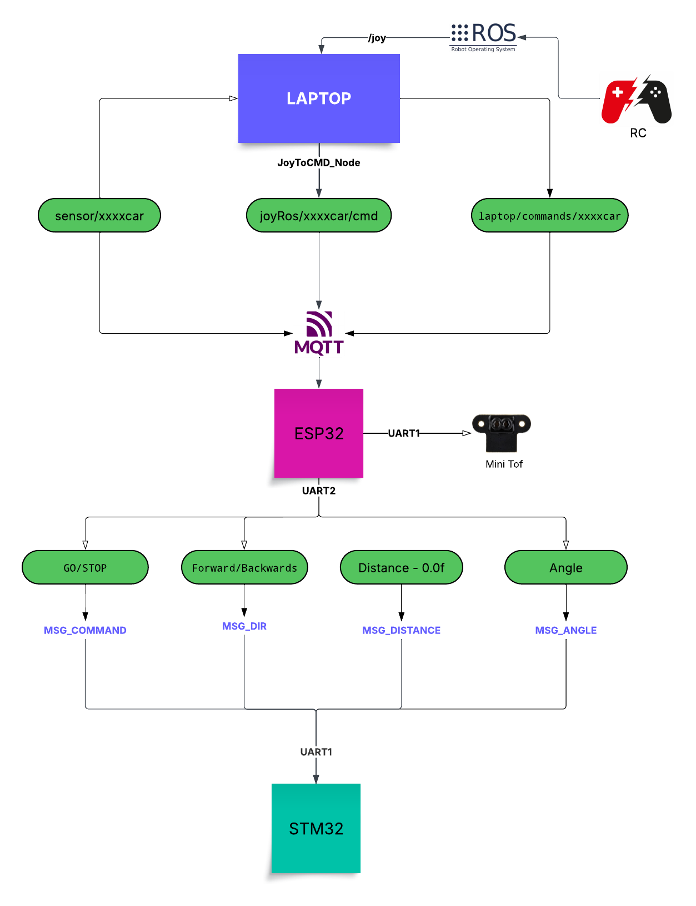

# TriFlameX – Autonomous Swarm Fire-Fighting Robots 

**TriFlameX** is an STM32-based firmware project designed to enable seamless control of multiple cars (blue, red, black) in both autonomous and manual modes. The system leverages MQTT and ROS2 for communication, allowing real-time control, monitoring, and coordination of vehicles.

---

## Features

- Supports autonomous and manual driving modes
- MQTT-based communication for control commands and status updates
- Real-time coordination between multiple cars
- Integration with ROS2 for modular and scalable software architecture
- Robust connectivity monitoring and message handling
- Control message format with commands, direction, distance, and angle
- Smooth switching between manual and autonomous operation

---

## Hardware Architecture



### 💡 Key Components

| Component               | Quantity / Car |
|-------------------------|----------------|
| DC Motors               | 4              |
| H-Bridge Motor Driver   | 1              |
| ESP32 Module            | 1              |
| STM32 Microcontroller   | 1              |
| Custom LiDAR (ToF + Stepper) | 1        |
| Buck Converters         | 2 (5V & 3.3V)   |
| 3S LiPo Battery         | 1              |

---

## System Software Architecture



### 🧩 Subsystems

- **STM32 (C, direct register)**: Controls motors, handles PD algorithms, receives commands via UART
- **ESP32 (Arduino/FreeRTOS)**: Reads LiDAR, calculates distance and angle, communicates via MQTT
- **Laptop (Python, ROS2)**: Acts as central MQTT broker and monitor, visualizes LiDAR scans using Processing

---
## 📡 Communication

### 🔁 Inter-MCU
- **ESP32 ↔ STM32:** UART with custom packed binary protocol

### 🌍 Swarm Network
- **MQTT (over Wi-Fi)**: All ESP32 devices subscribe to:
  - `/car/<color>/distance`
  - `/car/<color>/control`
  - `/car/<color>/status`

### 🧠 Decision Logic
- Each car sends its distance to fire.
- Laptop selects the car with **lowest distance**.
- Only that car receives movement commands, others idle.

---

## 📐 Custom LiDAR Sensor


- **ToF VL53L0X** sensor mounted on a **NEMA 17 stepper**
- Performs **150° scans** in ~5 seconds
- Data is processed and visualized as a 2D point cloud in **Processing**
- STL file included: `/cad/lidar_mount.stl`

---

## 🎯 Motion Control

### 📌 PD Controllers

#### Distance Controller
```c
PWM = Kp_d * error_d + Kd_d * (error_d - prev_error_d);
```
#### Angle Controller
```c
Steering = Kp_a * angle_error + Kd_a * (angle_error - prev_error_a);
```
Saturation and dead zones implemented for stability

Forward/backward and turning control are combined

## Installation / Build & Run Instructions

Prerequisites

   - STM32 C toolchain (Keil, STM32CubeIDE, or arm-none-eabi)

   - ESP32 Arduino or FreeRTOS SDK
   - Python 3.10+ for MQTT broker and visualization
   - ROS2 (optional, for integration)
   - MQTT broker (e.g., Mosquitto or broker running on laptop)

Steps

1. Clone the repository:

   ```bash
   git clone https://github.com/RoboMechanix/TriFlameX/
   cd TriFlameX
   ```

2. Install dependencies:

   - ESP-IDF for ESP32 firmware development
   - ROS2 Humble (or the ROS2 version you use)
   - MQTT Broker (Mosquitto)

3. Flash the firmware to the ESP32:

   ```bash
   idf.py -p /dev/ttyUSB0 flash monitor
   ```
4. Run the Python broker or ROS2 nodes on your host PC.

5. Start the MQTT visualizer.

6. Place fire object, watch the swarm coordinate.
---

## Usage

- **Manual Mode:** Control cars directly via MQTT messages with ROS2 topics.
- **Autonomous Mode:** Cars operate based on autonomous navigation algorithms implemented in Python.
- Switch modes dynamically by sending control commands.

---


## Contribution

Contributions are welcome! Please open an issue or submit a pull request with improvements or bug fixes.

---

## 📜 License

MIT License – Feel free to fork, adapt, and extend.

---

## Contact

For questions or support, contact Mohammed Abdelazim at [mohammed@azab.io] or via GitHub [Mohammed-Azab] or Mohamed Elsheemy at [mo.sheemy21@gmail.com] or via github at [RealBliTzPro] .
