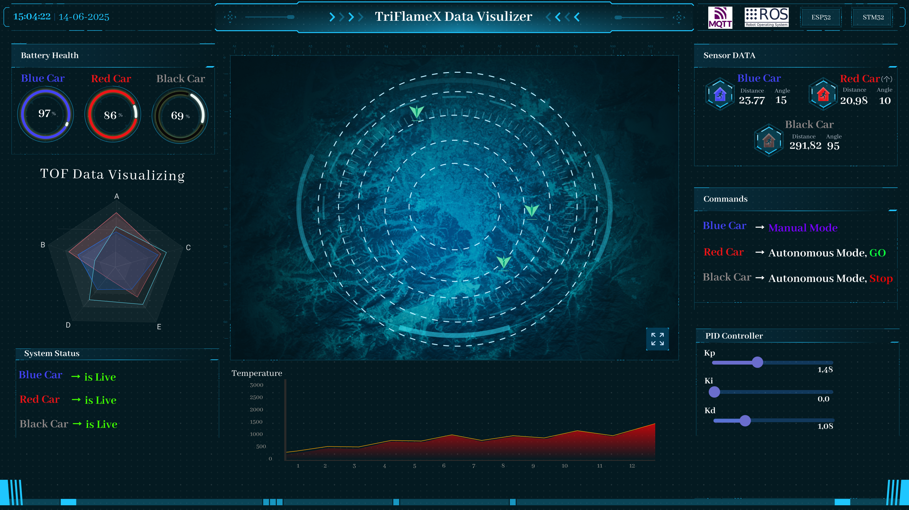
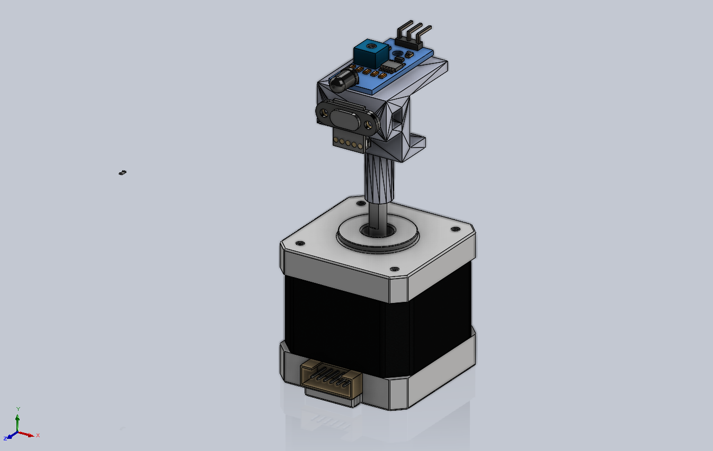

# TriFlameX – Autonomous Swarm Fire-Fighting Robots 

**TriFlameX** is an STM32-based firmware project designed to enable seamless control of multiple cars (blue, red, black) in both autonomous and manual modes. The system leverages MQTT and ROS2 for communication, allowing real-time control, monitoring, and coordination of vehicles.


---

## TriFlameX Visualizer GUI

Below is a screenshot of the custom-built TriFlameX Visualizer GUI, which displays real-time system information including sensor data, robot states, LiDAR scans, and decision-making logs.



## Features

- Supports autonomous and manual driving modes
- MQTT-based communication for control commands and status updates
- Real-time coordination between multiple cars
- Integration with ROS2 for modular and scalable software architecture
- Robust connectivity monitoring and message handling
- Control message format with commands, direction, distance, and angle
- Smooth switching between manual and autonomous operation

---

## Hardware Architecture


###  Key Components

| Component               | Quantity / Car |
|-------------------------|----------------|
| DC Motors               | 4              |
| H-Bridge Motor Driver   | 1              |
| ESP32 Module            | 1              |
| STM32 Microcontroller   | 1              |
| Custom LiDAR (ToF + Stepper) | 1        |
| Buck Converters         | 2 (5V & 3.3V)   |
| 3S LiPo Battery         | 1              |

---

## System Software Architecture

The TriFlameX system architecture consists of three primary layers: the central laptop controller, ESP32 modules on each car, and STM32 microcontrollers connected to the car's actuators. Communication flows from sensor acquisition to actuation, coordinated through wireless and wired protocols.


### 🧩 Subsystems

- **STM32 (C, direct register)**: Controls motors, handles PD algorithms, receives commands via UART
- **ESP32 (Arduino/FreeRTOS)**: Reads LiDAR, calculates distance and angle, communicates via MQTT
- **Laptop (Python, ROS2)**: Acts as central MQTT broker and monitor, visualizes LiDAR scans using Processing

---
## 📡 Communication

#### Components and Communication Links
Laptop (Central Brain):
- Connected via Wi-Fi to ESP32 modules.
- Runs control logic in Python.
- Subscribes and publishes MQTT topics for sensor data and commands.

ESP32 Modules (One per Car):
- Reads Time-of-Flight (ToF) sensor data via UART1.
- Publishes sensor data to laptop via MQTT.
- Receives commands from laptop via MQTT.
- Forwards commands to STM32 over UART2 using a custom binary protocol.
- Subscribes to joystick commands in manual mode and forwards to STM32.

STM32 Microcontrollers:
- Connected to ESP32 via UART2.
- Receives commands, verifies packet integrity.
- Sends acknowledgments (ACK).
- Controls motors and servos based on commands.


### 🔁 Inter-MCU
- **ESP32 ↔ STM32:** UART with custom packed binary protocol

# UART Packet Format

Each UART packet sent from ESP32 to STM32 consists of **6 bytes**:

| Byte Index | Field        | Description                                       |
|------------|--------------|---------------------------------------------------|
| 0          | Start Byte   | `0xAA` — indicates beginning of message           |
| 1–3        | Payload      | 3-byte packed data (see layout below)             |
| 4          | Checksum     | XOR of bytes 1–3                                  |
| 5          | End Byte     | `0x55` — indicates end of message                 |

### 🔐 Checksum:
- Ensures data integrity.  
- `checksum = byte1 ^ byte2 ^ byte3`

### 📩 ACK:
- STM32 replies with `0xCC` after successful message parsing and checksum validation.

---

## Bit Layout (24 bits = 3 bytes Payload):

**[command:1][dir:1][distance:14][angle:8]**

| Field      | Description                   |no of BITS |
|------------|-------------------------------|-----------|
| Command    | Type of control command       | 1 bit     |
| Direction  | Direction of movement         | 1 bit     |
| Distance   | Distance to move or target    | 14 bit    |
| Angle      | Steering angle or turn value  | 8 bit     |

command -> STOP/GO
Direction -> FORWARD/BACKWARDS
Distance -> min (0) - Max (16383) in cm
Angle -> Min (0) - Max (255)

###  Decision Logic
- Each car sends its distance to fire.
- Laptop selects the car with **lowest distance**.
- Only that car receives movement commands, others idle.

---

## 📐 Custom-Made Thermal LiDAR Sensor



- **ToF VL53L0X** sensor mounted on a **NEMA 17 stepper** which Performs **span° scans** in being able to be edited in file default value of 126°
- Data is processed and visualized as a 2D point cloud in **Processing**
- STL file included: [Hardware DIR](hardware) 

---

## 🎯 Motion Control

### 📌 PD Controllers
Just change kp_distance, kd_distance , kp_angles , kd_angles to fit your own build and response


## Installation / Build & Run Instructions

Prerequisites

   - STM32 C toolchain (STM32CubeIDE)

   - ESP32 Arduino or FreeRTOS SDK
   - Python 3.10+ for MQTT broker and visualization
   - ROS2 (optional, for integration)
   - MQTT broker (Mosquitto)

Steps

1. Clone the repository:

   ```bash
   git clone https://github.com/RoboMechanix/TriFlameX/
   cd TriFlameX
   ```

2. Install dependencies:

   - ESP-IDF for ESP32 firmware development
   - ROS2 Humble (or the ROS2 version you use)
   - MQTT Broker (Mosquitto)

3. Flash the firmware to the ESP32:

   ```bash
   idf.py -p /dev/ttyUSB0 flash monitor
   ```
   or with arduino IDE

4. Flash the firmware to the STM32 with STM32CubeIDE using stlink

4. Run the Python broker by running [MQTT Client](firmware/laptop_mainBrain/mqtt_client.py) 

5. Run ROS2 Joy Node in your terminal and in another tab run [joytoCMD Node](firmware/laptop_mainBrain/triflamex_ros2_pkg/triflamex_ros2_pkg/joy_to_cmd_node.py)

5. Start the TriFlameX visualizer UI.

6. Place fire object, watch the swarm coordinate.


## Usage

- **Manual Mode:** Control cars directly via MQTT messages with ROS2 topics.
- **Autonomous Mode:** Cars operate based on autonomous navigation algorithms implemented in Python.
- Switch modes dynamically by sending control commands.


## Contribution

Contributions are welcome! Please open an issue or submit a pull request with improvements or bug fixes for further info refer to [CONTRIBUTING.md](CONTRIBUTING.md)


## 📜 License

[MIT License](LICENSE) – Feel free to fork, adapt, and extend. 


## Contact

For questions or support, contact 
   - Mohammed Abdelazim at [mohammed@azab.io] or via GitHub [Mohammed-Azab](https://github.com/Mohammed-Azab).
   - Mohamed Elsheemy at [mo.sheemy21@gmail.com] or via github at [RealBliTzPro].
